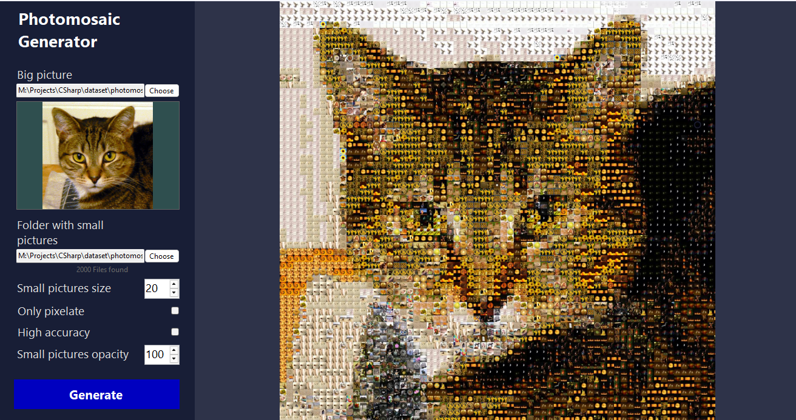
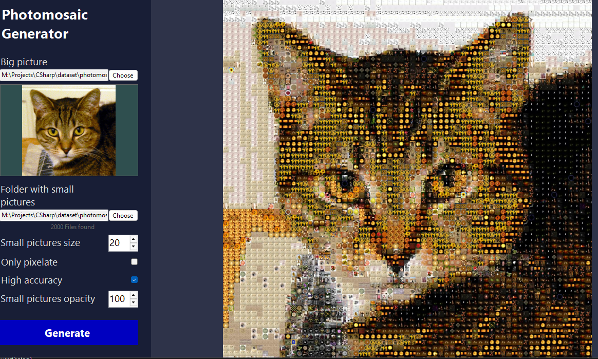
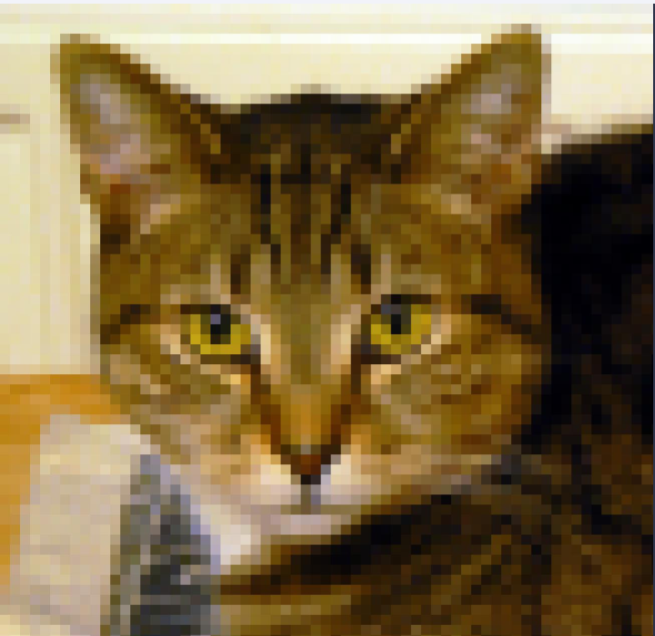

# Photomosaic Generator

A C# WinForms desktop application for creating photomosaics from source image and a collection of photos.

## How It Works
The application takes a source image and a folder containing photos that are used as mosaic tiles.

The source image is divided into a grid of square regions. For each region, the application finds a photo from the collection with the most similar average color and places it in that position.

### Matching Modes

#### Standard
Each region is represented by its average RGB color. The application uses 3D Euclidean distance in RGB color space to find the closest matching photo.

#### High Accuracy

Each region is divided into a 2×2 grid. Instead of comparing a single average color, the application compares four colors describing different parts of the region. This produces more accurate results, but requires more processing.

### Pixelate Mode

As an alternative to using photos, the application can fill each region with its average color to create a pixelated version of the source image.

## Examples

### Standard Mode

### High Accuracy Mode

### Pixelate Mode
Alternative mode that fills each square with a solid color (the average color of that square), creating a pixelated art effect.

More examples available in `assets/`.

## Features
- Adjustable mosaic tile size
- Standard and high-accuracy color matching
- Pixelate mode
- Adjustable tile opacity
- Preview of the generated mosaic
- Support for using a custom collection of images

## Technical Details
- Language: C#
- Framework: .NET 6
- GUI: Windows Forms
- Image Processing: SixLabors.ImageSharp

## Image Sources
The example photomosaics use images from the [CommonCatalog-CC-BY dataset](https://huggingface.co/datasets/common-canvas/commoncatalog-cc-by). All images used in the examples are licensed under the [Creative Commons Attribution 2.0 Generic License](https://creativecommons.org/licenses/by/2.0/).

The downloaded images are not included in this repository. The `metadata.jsonl` file contains the source and license information associated with the downloaded images, including the original image URL, author and license where available.

The metadata is kept to preserve attribution information for the images used by the application.
